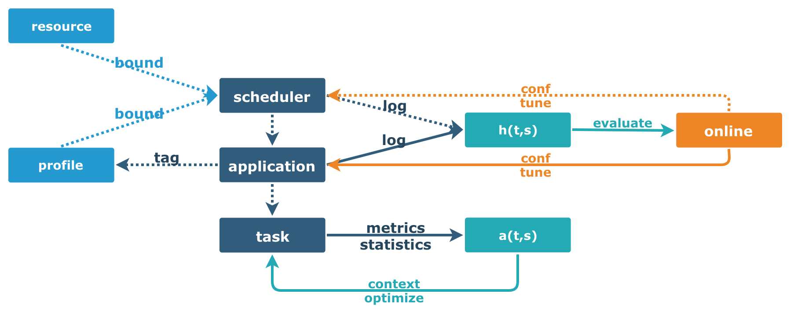

# Resource Tune

## References

- [Oversubscribing Apache Spark Resource Usage for Fun and $$$](https://databricks.com/session/oversubscribing-apache-spark-resource-usage-for-fun-and)
- [TuneIn: How to Get Your Hadoop/Spark Jobs Tuned While You’re Sleeping](https://databricks.com/session/tunein-how-to-get-your-hadoop-spark-jobs-tuned-while-you-are-sleeping)
- [JsonProtocol: Serializes SparkListener events to/from JSON](https://github.com/apache/spark/blob/master/core/src/main/scala/org/apache/spark/util/JsonProtocol.scala)
- [Alibaba Cluster Trace Program](https://github.com/alibaba/clusterdata/)